# BÁO CÁO GAME MINESWEEPER

## 3. Hướng dẫn sử dụng:

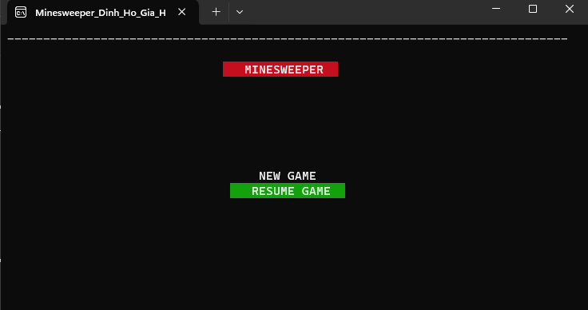

### ĐIỀU KHIỂN TRONG GAME Ở TẤT CẢ MÀN HÌNH

- Sử dụng những phím mũi tên lên, xuống, trái, phải để điều hướng.
- Phím Enter để chọn.
- Phím ESC để thoát.
- Phím A để mở ô, phím D để cắm cờ.

---

### Màn hình chính

Gồm các phím chức năng:
- **New game**: bắt đầu game mới.
- **Resume game**: chơi game được lưu.
- **Highscore**: xem bảng điểm highscore.
- **Quit**: thoát game, cũng có thể thoát bằng phím ESC.

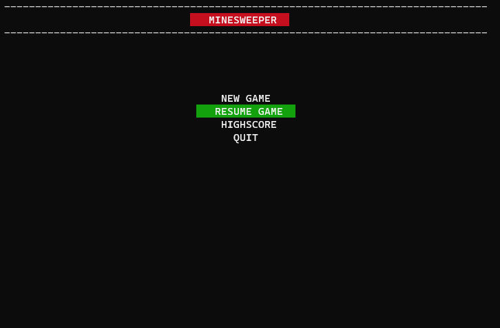

---

### NEW GAME

Dùng mũi tên lên xuống để điều hướng, Enter để chọn. Màn hình chọn độ khó có 3 mức độ.

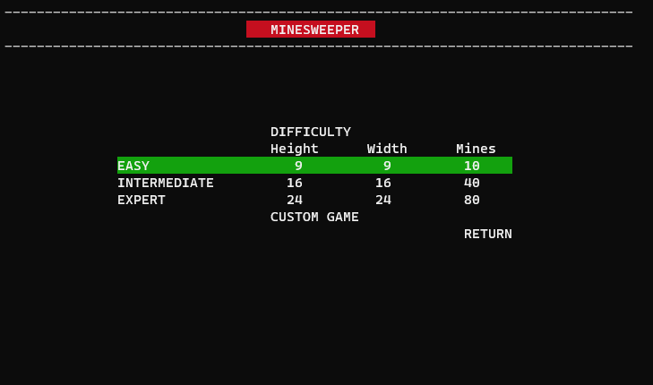

---

### CHẾ ĐỘ CUSTOM TẠO MAP RIÊNG

- Nhập vào chiều cao, chiều rộng, và số bom của map.

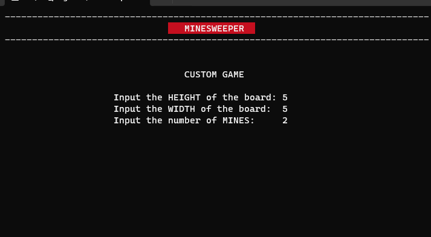

- Nếu nhập thông số vô lý (số bom nhiều hơn kích cỡ, nhập số âm), in ra thông báo lỗi và yêu cầu nhập lại.

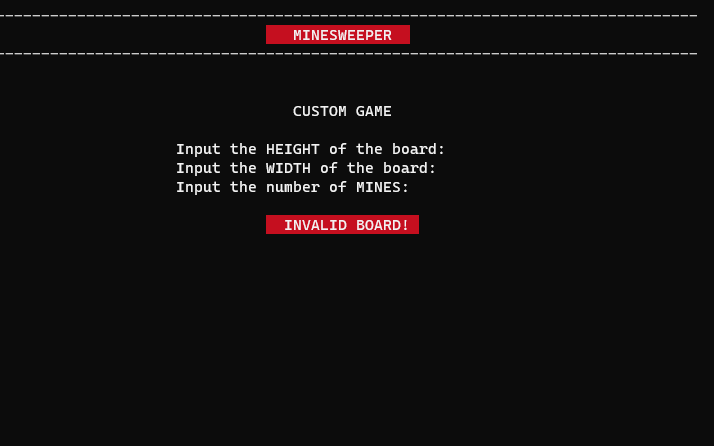

- Không dùng ESC được ở màn hình này, chỉ thoát khi nhập map hợp lệ.

---

### MÀN HÌNH CHƠI GAME

- Điều khiển: dùng mũi tên để điều hướng, phím A để mở ô, phím D để đặt cờ.
- Hiện kích cỡ map, số bom, thời gian hiện số giây từ lúc bắt đầu, trạng thái game nếu đang chơi sẽ hiện "PLAYING".
- Con trỏ màu tím, vị trí bắt đầu của con trỏ ở ô trên cùng bên trái.
- Vị trí ở mỗi lần chơi sẽ khác nhau.
- Số bom sẽ được cập nhật: số bom giảm đi 1 với mỗi lá cờ được cắm. Nếu đặt nhiều cờ hơn số bom, số bom sẽ hiện âm thay vì 0.

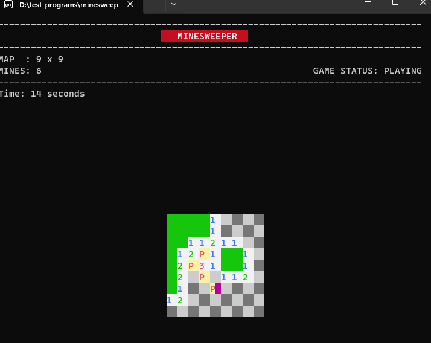

- Khi nhấn phím ESC sẽ hiện menu để save game, nút return để thoát ra ngoài.
- Dùng mũi tên để điều hướng, Enter để chọn.
- Nếu chọn save game, sẽ hiện ra dòng chữ "Your game has been saved."

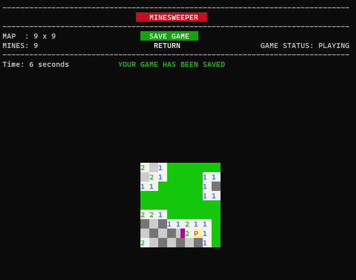

---

### RESUME GAME

Tiếp tục chơi game đã được lưu, thời gian bắt đầu từ thời gian đã lưu.

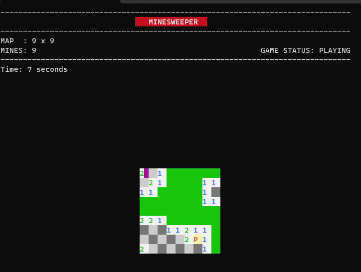

---

### MÀN HÌNH THẮNG

- Hiện chữ "YOU WON".
- Nếu đạt highscore cao nhất thì hiện "YOU REACHED NEW HIGHSCORE".

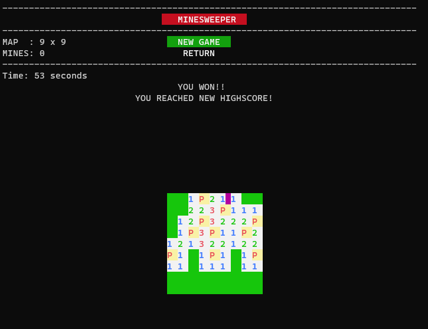

---

### MÀN HÌNH THUA

- Hiện vị trí tất cả những quả bom, vị trí những lá cờ đặt đúng và những lá cờ đặt sai.
- Hiện chữ "YOU LOST".
- Hiện menu gồm 2 phím: **New game** (tạo game mới) và **Return**.

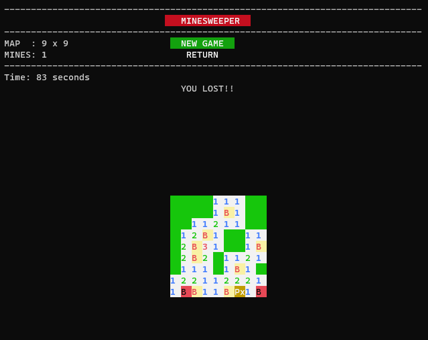

---

### HIGHSCORE

Hiện top 3 thời gian nhanh nhất: first, second, third.

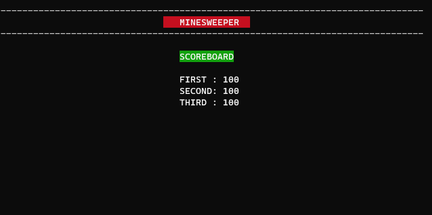
